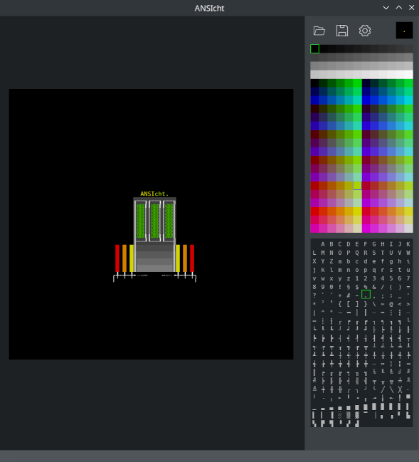

# ANSIcht

(A play on the words ANSI and "Ansicht",
the german word for "point of view" or "perspective".)

# Description
ANSIcht is a simple text art editor that supports
24bit colors and unicode text. Right now, the feature
set is very limited to a basic, on-the-fly calculated
color palette and pre-defined text characters, as
well as single pixel drawing.

This was developed for a personal game project, and
I'm happy to share it with everybody!

Currently, ANSIcht exports and reads from .txt files
containing characters and ANSI escape sequences.

# Installation
  git clone https://github.com/dewberryants/ANSIcht.git
  cd ANSIcht
  pip install . --user

# Use
  ansicht

# Known Issues
 * Palette Scaling is very jumpy
 * No scrolling on palette / character map
 * Zooming cant restore original pixel size
 * No custom palette
 * Dark Mode Only

# Closing Words

Many thanks go out to the developers of pygame,
which ANSIcht is mostly developed in.

Happy painting!
