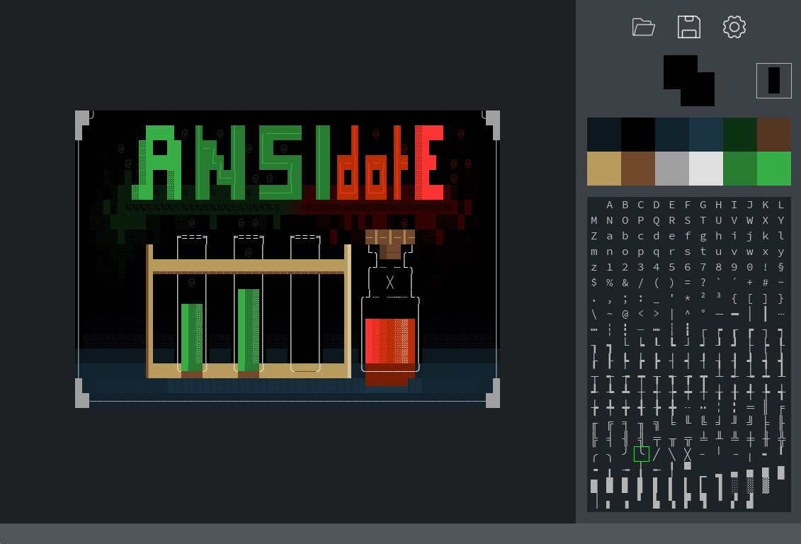

# ansidote

ansidote - short for ANSI.edit

# Description
ansidote is a simple text art editor that supports
8bit colors and unicode text. Right now, the feature
set is very limited to a basic, on-the-fly calculated
color palette and pre-defined text characters, as
well as single pixel drawing.

This was developed for a personal game project, and
I'm happy to share it with everybody!

Currently, ansidote exports and reads from .txt files
containing characters and ANSI escape sequences.

# Installation
    git clone https://github.com/dewberryants/ansidote.git
    cd ansidote
    pip install . --user

# Use
    ansidote

# Known Issues
 * No scrolling on palette / character map
 * Dark Mode Only

# Closing Words

Many thanks go out to the developers of pygame,
which ansidote is mostly developed in.

Happy painting!
